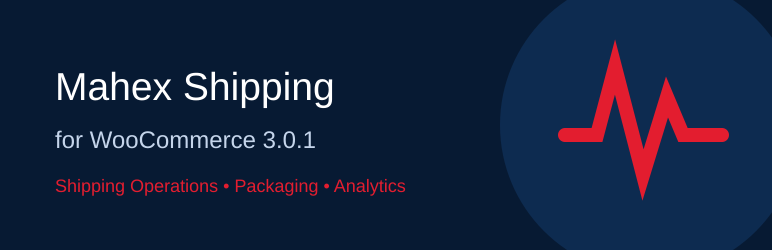
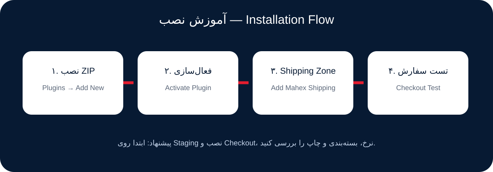
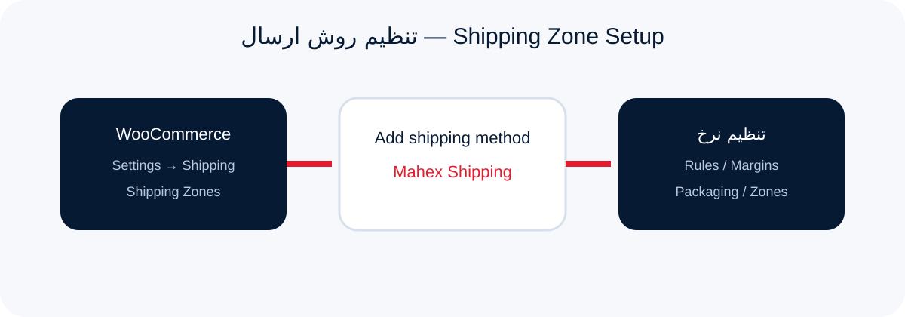
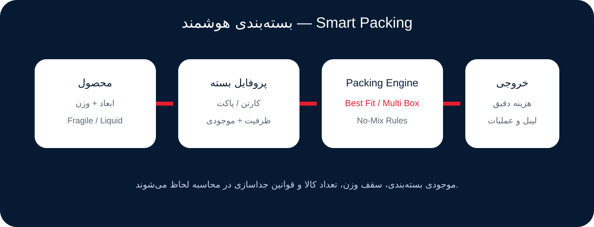
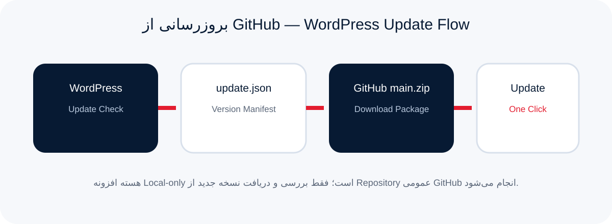

# Mahex Shipping for WooCommerce 3.1.0

<div align="center">



**سامانه حرفه‌ای مدیریت ارسال ووکامرس — Professional WooCommerce Shipping Operations**

[](CHANGELOG.md)
[](https://www.php.net/)
[](https://wordpress.org/)
[](https://woocommerce.com/)
[](LICENSE)

[مستندات فارسی](#فارسی) · [English](#english) · [Changelog](CHANGELOG.md) · [Security](SECURITY.md) · [Release Guide](RELEASING.md)

</div>

---

## تازه در نسخه ۳.۱.۰

راه‌اندازی فارسی، ورود گروهی CSV/XLSX، پیگیری مشتری، اعلان قابل تنظیم، صورتحساب و سود واقعی، تعرفه تاریخ‌دار و آپدیت با بررسی صحت فایل.

[راهنمای قابلیت‌ها و ارتقا](UPGRADE-3.1.0.md) · [دانلود نسخه ۳.۱.۰](https://github.com/anonyset/mahex-shipping-for-woocommerce/releases/download/v3.1.0/mahex-shipping-for-woocommerce-3.1.0.zip)

## فارسی

**Mahex Shipping for WooCommerce** یک پروژه مستقل و متن‌باز برای مدیریت عملیات ارسال داخل WordPress/WooCommerce است. افزونه نرخ‌گذاری، بسته‌بندی چندکارتنی، انبار و شعبه، Pick/Packing/QC، چاپ لیبل، رهگیری داخلی، گزارش مالی و تحلیل عملیات را در یک پنل جمع می‌کند.

> این پروژه مستقل است و ادعای رسمی‌بودن یا تأییدشدن توسط شرکت ماهکس ندارد.

### قابلیت‌های اصلی

- موتور نرخ‌گذاری شرطی AND/OR، اولویت Rule، وزن، مقصد، مبلغ سبد، نقش کاربر و Shipping Class.
- Margin Engine شامل سود درصدی/ثابت، یارانه، سهم مشتری، سقف کرایه و گردکردن امن.
- Smart Packing با Best Fit، Multi‑Box، محدودیت وزن/تعداد، Fragile/Liquid و No‑Mix.
- موجودی بسته‌بندی، دفتر ورود/خروج، هشدار کمبود، ارزش موجودی و انتقال بین شعب.
- Pick List، Packing Station، Ready‑to‑Ship، QC، Task Queue و ثبت عملکرد اپراتورها.
- شعب، انبارها، تخصیص سفارش، Rule Governance و Control Center شبکه.
- Label Builder، A4/Thermal، Barcode/QR، Print Queue و شمارش چاپ مجدد.
- Profit/Loss، Daily Metrics، Forecast، Loss Detector، Risk Score و Intelligence Center.
- Backup/Migration/Rollback، Safe Mode، Diagnostics، Repair Center و Release Guard.
- سازگاری با HPOS و واحد پول **ریال (IRR) / تومان (IRT)**.

### نصب سریع



1. ZIP افزونه را از **افزونه‌ها → افزودن → بارگذاری افزونه** نصب کنید.
2. WooCommerce را فعال نگه دارید.
3. از **WooCommerce → Settings → Shipping → Shipping Zones** روش **Mahex Shipping** را اضافه کنید.
4. از منوی **ماهکس** نرخ‌ها، بسته‌بندی، شعب و عملیات را تنظیم کنید.
5. قبل از Production یک سفارش کامل روی Staging تست کنید.



### بسته‌بندی هوشمند



برای هر محصول می‌توانید وزن/ابعاد، پروفایل بسته، انبار مبدا، زمان آماده‌سازی، گروه No‑Mix و داده‌های عملیاتی تعریف کنید. موتور بسته‌بندی بر اساس ظرفیت بسته، موجودی و قواعد جداسازی، تعداد و نوع بسته‌ها را محاسبه می‌کند.

### بروزرسانی از GitHub

نسخه **3.0.1** دارای Update Channel مستقیم GitHub است. WordPress به‌صورت دوره‌ای `update.json` شاخه انتشار `dist` را بررسی می‌کند و اگر نسخه جدیدتری منتشر شده باشد، بروزرسانی مثل سایر افزونه‌ها در **پیشخوان → بروزرسانی‌ها** و صفحه **افزونه‌ها** نمایش داده می‌شود.



هسته عملیات ارسال Local‑only است. فقط Update Checker برای بررسی نسخه و دریافت بسته بروزرسانی به GitHub متصل می‌شود. برای غیرفعال‌کردن Update Check:

```php
add_filter( 'hm_mahex_github_updates_enabled', '__return_false' );
```

### مستندات کامل

پس از فعال‌شدن GitHub Pages، مستندات دو‌زبانه در آدرس زیر قرار می‌گیرد:

**https://anonyset.github.io/mahex-shipping-for-woocommerce/**

---

## English

**Mahex Shipping for WooCommerce** is an independent open-source shipping operations platform for WordPress and WooCommerce. It combines pricing rules, multi-box packing, warehouses and branches, pick/pack/QC workflows, labels, local tracking, finance and operational analytics.

> This is an independent project and does not claim official endorsement or affiliation with Mahex.

### Highlights

- Conditional AND/OR pricing rules with priorities, shipping classes, destination, cart value and weight logic.
- Integer-safe margin engine with fixed/percentage margin, subsidy, customer share, caps and rounding.
- Best-fit multi-box packing with fragile/liquid/no-mix constraints and packaging inventory.
- Warehouse and branch operations, stock transfers, task queues and quality-control workflows.
- A4/thermal labels, barcode/QR output, print queues and reprint auditing.
- Profit/loss analytics, forecasts, loss detection, risk scoring and intelligence dashboards.
- Versioned migrations, rollback, safe mode, diagnostics, repair tools and release qualification.
- HPOS support and IRR/IRT currency-aware calculations.

### GitHub updates

Version **3.0.1** includes a native WordPress update channel backed by this public repository. WordPress checks the published `dist/update.json` manifest and offers a normal one-click plugin update when a newer version is published.

The shipping core remains local-only; only version checks and update downloads contact GitHub.

### Requirements

- WordPress 7.1+
- WooCommerce 11.0+
- PHP 8.1+

### Documentation

**https://anonyset.github.io/mahex-shipping-for-woocommerce/**

---

## Development & release

- `update.json` — public WordPress update manifest.
- `src/Update/GitHubUpdater.php` — native GitHub update integration.
- `docs/` — bilingual GitHub Pages site and visual tutorials.
- `.github/workflows/ci.yml` — PHP lint and manifest validation.
- `.github/workflows/pages.yml` — GitHub Pages deployment workflow.
- `RELEASING.md` — safe version publication checklist.

## License

GPL-2.0-or-later. See [LICENSE](LICENSE).

**Author:** Hosein Momeni — https://postyekrooz.ir/plugins

## دانلود و نصب آسان

**[دانلود آخرین نسخه قابل نصب](https://github.com/anonyset/mahex-shipping-for-woocommerce/releases/latest)** · **[آرشیو همه نسخه‌ها](https://github.com/anonyset/mahex-shipping-for-woocommerce/releases)**

برای هر نسخه، فایل مستقل `mahex-shipping-for-woocommerce-VERSION.zip` در بخش **Assets** همان Release موجود است.

1. فایل ZIP نسخه دلخواه را از Assets دانلود کنید.
2. وردپرس ← افزونه‌ها ← افزودن افزونه ← بارگذاری افزونه.
3. ZIP را انتخاب کنید، نصب و سپس فعال کنید.

فایل‌های **Source code** برای دریافت کد پروژه هستند؛ فایل نصب با نام افزونه و شماره نسخه را انتخاب کنید.
نسخه‌های منتشرشده حفظ می‌شوند. برای تغییر کد قابل نصب، شماره نسخه جدید منتشر می‌شود.

## کانال آپدیت وردپرس

[دانلود بسته نصب از کانال آپدیت](https://raw.githubusercontent.com/anonyset/mahex-shipping-for-woocommerce/dist/mahex-shipping-for-woocommerce.zip)

بسته دانلود پس از اجرای موفق گردش‌کار Publish WordPress update channel ساخته می‌شود. فایل ZIP بخش Code برای نصب مستقیم در وردپرس توصیه نمی‌شود.
